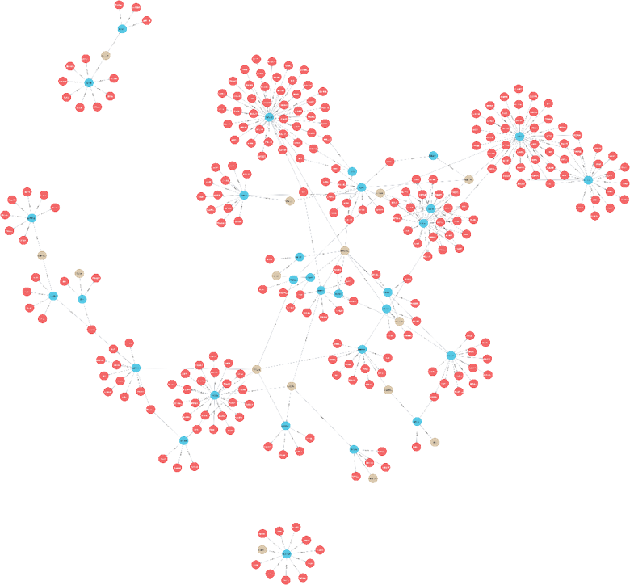

# 面向大学生群体的教育知识图谱

## 数据准备

数据位于 `.\data\raw_csv` 中，将数据拷贝到正确位置后，在 neo4j 内执行如下语句：

```cypher
LOAD CSV WITH HEADERS FROM "file:///relations.csv" AS line 
merge (B:chapter{title:line.entity1Item})
merge (F:knowledge{title:line.NewNode})
MERGE (B)-[r:contain]->(F)

LOAD CSV WITH HEADERS FROM "file:///relations2.csv" AS line 
merge (B:course{title:line.course1})
merge (F:chapter{title:line.title})
MERGE (B)-[r:contain]->(F)
```



若得到的节点上显示乱码，则可用当前文件夹内 `check_csv.py` 来检测编码并改变。

## 程序运行

进入 `GUI.py`，修改如下内容为你创建知识图谱的内容：

```python
class KG_show:
    def __init__(self, root):
        self.emb = Embedding()
        self.graph = KnowledgeGraph(
            URI="bolt://localhost:7687",
            AUTH=("neo4j", "12345678"),
            embedding_model=self.emb
        )
```

**注意**：运行时因为要获取到Bert模型参数，建议**科学上网**。

---

## 模式

1. 直接匹配：输入预查询内容的名称。课程大纲同理。

2. 模糊匹配：输入预查询内容的名称。

3. 关系添加，若接入LLM则输入自然语言，否则按照类似如下格式：

   ```python
   本体1 实例1 本体2 实例2 关系
   e.g. chapter 人工智能研究者 knowledge 高eason contain
   ```

4. 复杂查询：若接入LLM则输入自然语言，否则输入若干要查询的课程，用空格隔开。

具体效果请查看 `效果.pdf`

---

## Contributors
1. Yi Huang: https://github.com/hydrogenhy
2. YiSenGao: https://github.com/Eason-nuosen
3. Jiaze Song: 
